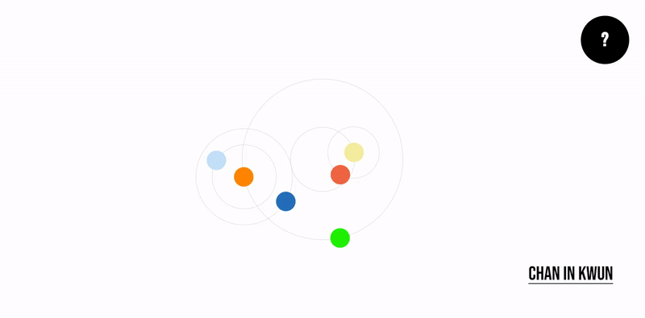
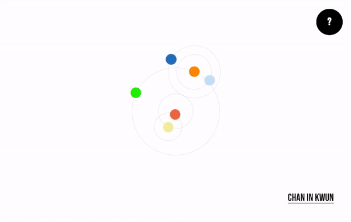
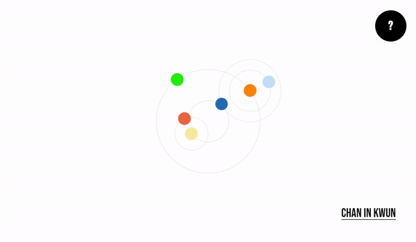
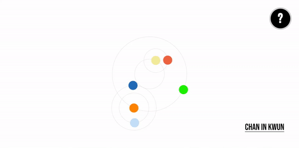

# HanSeoulOh Portfolio <!-- omit in toc -->
## Table of Contents <!-- omit in toc -->
- [Introduction](#introduction)
- [Codebase](#codebase)
  - [Technologies](#technologies)
  - [Folder Structure](#folder-structure)
  - [Setup Process](#setup-process)
- [Features](#features)
  - [Planets](#planets)
  - [Hover Stop](#hover-stop)
  - [Help](#help)
  - [Content](#content)
  - [Responsive Design](#responsive-design)
- [Acknowledgements](#acknowledgements)

# Introduction
This is my portfolio website featuring a solar system-inspired design **based on Ptolemy's model** of the solar system that allows users to interact with each planet, each representing a section of my portfolio. I designed and developed the website from start to finish using **ReactJS and Redux** to ensure that the user experience matches my vision as closely as possible based on my current skill set. So go ahead, explore the galaxy of my work and see what each planet has to offer!
<br />
<p align="center">
  
</p>
<br />

# Codebase
## Technologies
This codebase consists of JavaScript, HTML and CSS.

Frameworks/Libraries Used:
- ReactJS
- Redux
<br />

## Folder Structure
```sh
portfolio/
├── public                  # Public files
└── src                     # Source files
portfolio/src
├── components              # Reusable components
├── resources               # Resources
│   ├── images              # Image and gif files
│   └── videos              # Video files
└── store                   # Redux store and slices
```
<br />

## Setup Process
- Clone or download the repo
- Open the directory and run `npm install` to install
- Run development application by using `npm start`
<br />

# Features
## Planets
As you explore my portfolio, you'll discover a series of planets, each containing a different section of my work. From an "About Me" page to an overview of my projects, each planet offers a unique glimpse into my skills and experience. To interact with a planet, simply click on it and it will move to the center of its orbit and grow in size displaying a brief summary of the section's content. Even while a planet is in focus, you can still navigate between different sections of the portfolio with ease.
<br />
<p align="center">
  
</p>
<br />

## Hover Stop
Each planet has a hover stop feature allowing for a smoother planet selection by lighting up the planet's orbit and stopping the animation when the user hovers over it. This feature is only available when viewing the site in a desktop browser or any device navigating the site with a mouse or trackpad which allow hover events to trigger.
<br />
<p align="center">
  
</p>
<br />

## Help
A help section has been added in the upper left corner, represented by a question mark icon, to ensure that all visitors can easily navigate the portfolio site. This section provides a tutorial as for how to navigate the site for first-time visitors who may find the site's navigation less intuitive. The aim of this addition is to make the site more user-friendly and accessible to everyone.
<br />
<p align="center">
  
</p>
<br />

## Content
I tested two different ways for users to view the content of each section to see which would allow for a smoother visualization that aligns with the overall feel of the portfolio. The previous design for the scrollable content is displayed below to show how it was updated in the next section to account for responsive design.
<br />
<p align="center">
  
</p>
<br />

## Responsive Design
I created a simple media query in CSS to detect a portrait viewport as a mobile device, instead of making a separate media query for each screen size. This saved time and was possible because the portfolio has a simple enough design. Additionally, the title of each section grows or shrinks depending on the scroll direction the user makes, allowing for a better visualization of the content. This feature is only available on mobile devices when viewing the site in portrait mode.
<br />
<p align="center">
  
  
</p>
<br />

# Acknowledgements
These other dependencies used to build this project:
- react-icons
- react-intersection-observer

